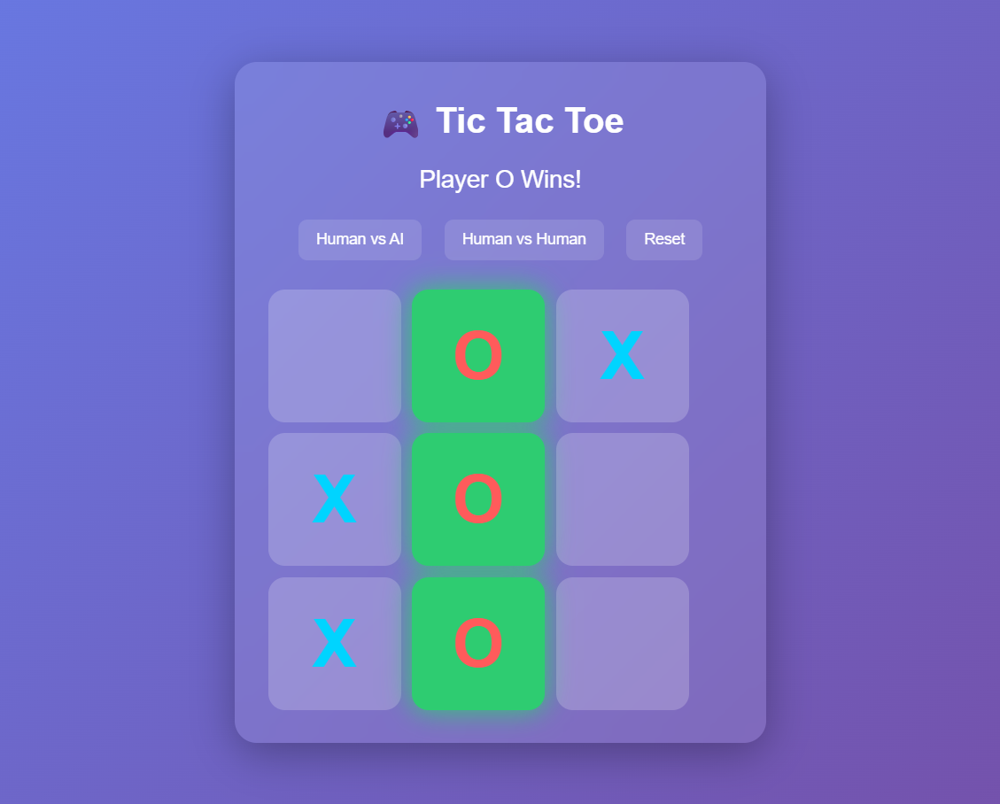

🎮 Tic Tac Toe (Golang Web Game)

A modern Tic Tac Toe web application built with Golang featuring an interactive UI, animations, and AI gameplay.
The project demonstrates backend logic with Go templates, basic game algorithms, and a responsive frontend.

This project is ideal for learning Go web development, template rendering, and game logic implementation.

# Features

✨ Modern Glass UI Design
✨ Smooth move animations for X and O
✨ Human vs Human mode
✨ Human vs AI mode
✨ AI thinking animation
✨ Winning cell highlight animation
✨ Game reset functionality
✨ Responsive and interactive grid
✨ Built using Go HTML templates

# Game Logic

## The backend manages the entire game state:

Tracks the game board

Detects winning combinations

Handles player turns

Executes AI moves

Resets the game state

## Winning combinations are checked for:

Rows
Columns
Diagonals

Example:

X | X | X
---------
O | O |
---------
  |   |

When a player wins, the winning cells glow with animation.

# Tech Stack

## Backend

Golang
net/http
HTML Templates

## Frontend

HTML5
CSS3
Animations (CSS keyframes)

# Project Structure
tic-tac-toe/
│
├── main.go
├── handlers.go
├── game.go
│
├── templates/
│   └── index.html
│
└── README.md

# How to Play

## Choose a game mode

1. Human vs Human
2. Human vs AI

Click any empty cell to make a move.

## Players take turns placing:

X
O

The first player to align 3 symbols in a row wins.

## AI Mode

The AI automatically plays after the human move.

## Current AI behavior:

Selects an available cell

Simulates simple decision making

## Future improvement:

Minimax Algorithm

which makes the AI impossible to beat.

Example UI:

🎮 Tic Tac Toe
Turn: X

[ ] [ ] [ ]
[ ] [ ] [ ]
[ ] [ ] [ ]
📸 Demo
<<<<<<< HEAD

=======

>>>>>>> 2e45afb045dc662950db9e119d0d3fcd9a1dae72

You can run the application locally to see the UI animations and gameplay.

# Learning Outcomes

This project demonstrates:

Building web applications in Golang

Working with Go templates

Implementing game logic

Managing server state

Creating interactive UI using CSS animations

# Future Improvements

Possible enhancements:

Minimax AI

Scoreboard

Multiplayer with WebSockets

Game history

Mobile responsive design

Sound effects

Player name support

👨‍💻 Author

Nihal Vishwakarma

Software Developer
Golang | Backend Development | APIs | Distributed Systems
